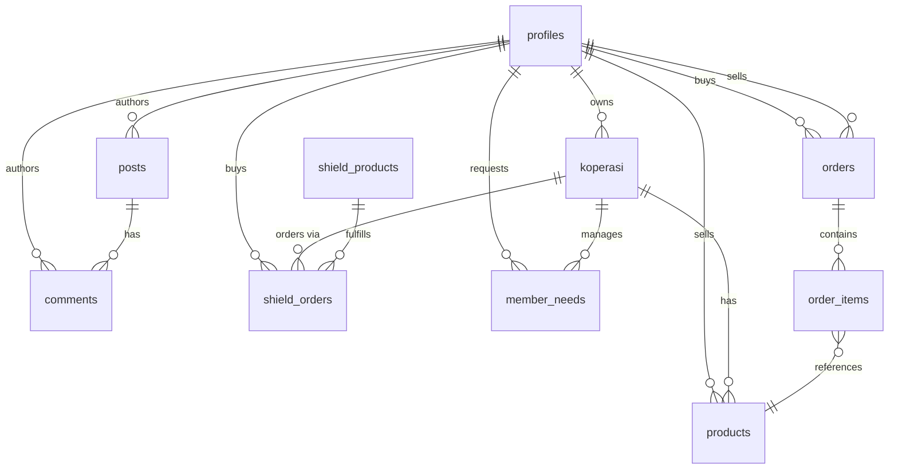

# Agrou — Database Schema

> File referensi untuk semua tabel, relasi, enum, RLS policy, dan realtime config.
> Schema source of truth ada di `agrou/supabase/01_schema.sql`.

---

## 1. Enums

| Enum | Values |
|---|---|
| `user_role` | `petani`, `koperasi`, `pembeli`, `admin` |
| `order_status` | `pending`, `confirmed`, `processing`, `shipped`, `delivered`, `cancelled` |
| `shield_status` | `draft`, `active`, `claimed`, `expired`, `rejected` |
| `product_category` | `padi`, `jagung`, `kedelai`, `sayuran`, `buah`, `perkebunan`, `peternakan`, `perikanan`, `lainnya` |

---

## 2. Tabel — 11 Tabel Aktif

### `profiles`
Auto-created via trigger `handle_new_user` saat user baru mendaftar di `auth.users`.

| Kolom | Tipe | Keterangan |
|---|---|---|
| `id` | `uuid` PK | FK ke `auth.users.id` |
| `full_name` | `text` | Nama lengkap |
| `avatar_url` | `text` nullable | URL ke bucket `avatars` |
| `bio` | `text` nullable | Bio singkat |
| `phone` | `text` nullable | Nomor telepon |
| `role` | `user_role` | Default: `pembeli` |
| `is_verified` | `boolean` | Default: `false` |
| `created_at` | `timestamptz` | — |
| `updated_at` | `timestamptz` | — |

---

### `koperasi`
Satu user dengan role `koperasi` bisa memiliki satu profil koperasi.

| Kolom | Tipe | Keterangan |
|---|---|---|
| `id` | `uuid` PK | — |
| `owner_id` | `uuid` FK | → `profiles.id` |
| `name` | `text` | Nama koperasi |
| `description` | `text` nullable | Deskripsi |
| `location` | `text` nullable | Lokasi / kabupaten |
| `province` | `text` nullable | Provinsi |
| `logo_url` | `text` nullable | URL ke bucket `koperasi` |
| `banner_url` | `text` nullable | URL ke bucket `koperasi` |
| `phone` | `text` nullable | Kontak koperasi |
| `email` | `text` nullable | Email koperasi |
| `member_count` | `int` | Default: 0 |
| `rating` | `numeric(3,2)` nullable | Rating rata-rata |
| `is_verified` | `boolean` | Default: `false` |
| `verified_farm_badge` | `boolean` | Default: `false` — badge Data Bridge |
| `commodity_focus` | `text[]` nullable | Array komoditas utama |
| `created_at` | `timestamptz` | — |
| `updated_at` | `timestamptz` | — |

---

### `products`
Produk yang dijual di Agrou Market / katalog.

| Kolom | Tipe | Keterangan |
|---|---|---|
| `id` | `uuid` PK | — |
| `seller_id` | `uuid` FK | → `profiles.id` |
| `koperasi_id` | `uuid` FK nullable | → `koperasi.id` |
| `name` | `text` | Nama produk |
| `description` | `text` nullable | Deskripsi |
| `category` | `product_category` | Kategori komoditas |
| `price` | `numeric(12,2)` | Harga satuan IDR |
| `unit` | `text` | Satuan (kg, ikat, karung, dll) |
| `stock` | `int` | Default: 0 |
| `images` | `text[]` | Array URL ke bucket `products` |
| `is_active` | `boolean` | Default: `true` (soft delete via `false`) |
| `sold_count` | `int` | Default: 0 — untuk best sellers |
| `created_at` | `timestamptz` | — |
| `updated_at` | `timestamptz` | — |

---

### `orders`
Order dari pembeli ke penjual.

| Kolom | Tipe | Keterangan |
|---|---|---|
| `id` | `uuid` PK | — |
| `buyer_id` | `uuid` FK | → `profiles.id` |
| `seller_id` | `uuid` FK | → `profiles.id` |
| `status` | `order_status` | Default: `pending` |
| `total_amount` | `numeric(12,2)` | Total nilai order |
| `shipping_address` | `text` nullable | Alamat pengiriman |
| `notes` | `text` nullable | Catatan dari pembeli |
| `created_at` | `timestamptz` | — |
| `updated_at` | `timestamptz` | — |

Realtime enabled: **✓**

---

### `order_items`
Line items dari tiap order.

| Kolom | Tipe | Keterangan |
|---|---|---|
| `id` | `uuid` PK | — |
| `order_id` | `uuid` FK | → `orders.id` |
| `product_id` | `uuid` FK | → `products.id` |
| `quantity` | `int` | Jumlah item |
| `price` | `numeric(12,2)` | Harga saat order |

> ⚠️ **Perhatian**: Ada potensi drift antara kolom di `database.types.ts` dan `01_schema.sql`. Lihat `04_KNOWN_ISSUES.md` untuk detailnya.

---

### `shield_products`
Produk proteksi lahan di Agrou Farm (pestisida, pupuk, dll).

| Kolom | Tipe | Keterangan |
|---|---|---|
| `id` | `uuid` PK | — |
| `name` | `text` | Nama produk proteksi |
| `description` | `text` nullable | — |
| `category` | `text` | Kategori proteksi |
| `price` | `numeric(12,2)` | Harga satuan IDR |
| `images` | `text[]` nullable | — |
| `is_active` | `boolean` | Default: `true` |
| `created_at` | `timestamptz` | — |

> ⚠️ **Perhatian**: `database.types.ts` mendefinisikan kolom `commodity`, `premium`, `coverage_area` yang tidak ada di `01_schema.sql`. Ini adalah schema drift yang perlu direkonsiliasi. Lihat `04_KNOWN_ISSUES.md`.

---

### `shield_orders`
Order produk proteksi dari koperasi/petani.

| Kolom | Tipe | Keterangan |
|---|---|---|
| `id` | `uuid` PK | — |
| `buyer_id` | `uuid` FK | → `profiles.id` |
| `product_id` | `uuid` FK | → `shield_products.id` |
| `koperasi_id` | `uuid` FK nullable | → `koperasi.id` |
| `status` | `shield_status` | Default: `draft` |
| `quantity` | `int` | — |
| `total_amount` | `numeric(12,2)` | — |
| `notes` | `text` nullable | — |
| `created_at` | `timestamptz` | — |

---

### `promos`
Banner promo yang tampil di `PromoBanner` homepage.

| Kolom | Tipe | Keterangan |
|---|---|---|
| `id` | `uuid` PK | — |
| `title` | `text` | Judul promo |
| `description` | `text` nullable | — |
| `image_url` | `text` nullable | URL ke bucket `promos` |
| `link` | `text` nullable | URL tujuan klik |
| `is_active` | `boolean` | Default: `true` |
| `starts_at` | `timestamptz` nullable | — |
| `ends_at` | `timestamptz` nullable | — |
| `created_at` | `timestamptz` | — |

---

### `posts`
Post komunitas di `KomunitasPage`.

| Kolom | Tipe | Keterangan |
|---|---|---|
| `id` | `uuid` PK | — |
| `author_id` | `uuid` FK | → `profiles.id` |
| `content` | `text` | Isi post |
| `images` | `text[]` nullable | — |
| `likes` | `int` | Default: 0 |
| `created_at` | `timestamptz` | — |
| `updated_at` | `timestamptz` | — |

Realtime enabled: **✓**

---

### `comments`
Komentar pada post komunitas.

| Kolom | Tipe | Keterangan |
|---|---|---|
| `id` | `uuid` PK | — |
| `post_id` | `uuid` FK | → `posts.id` |
| `author_id` | `uuid` FK | → `profiles.id` |
| `content` | `text` | — |
| `created_at` | `timestamptz` | — |

Realtime enabled: **✓**

---

### `member_needs`
Kebutuhan anggota koperasi — dikelola via Dashboard.

| Kolom | Tipe | Keterangan |
|---|---|---|
| `id` | `uuid` PK | — |
| `koperasi_id` | `uuid` FK | → `koperasi.id` |
| `member_id` | `uuid` FK | → `profiles.id` |
| `title` | `text` | Judul kebutuhan |
| `description` | `text` nullable | — |
| `quantity` | `int` nullable | — |
| `unit` | `text` nullable | — |
| `status` | `text` | Default: `open` |
| `created_at` | `timestamptz` | — |

---

## 3. Trigger & Functions

### `handle_new_user`
Trigger `AFTER INSERT ON auth.users` — otomatis membuat row di `profiles`:
```sql
INSERT INTO public.profiles (id, full_name, role)
VALUES (
  NEW.id,
  NEW.raw_user_meta_data->>'full_name',
  COALESCE(NEW.raw_user_meta_data->>'role', 'pembeli')
);
```

### `increment_post_likes`
RPC function yang bisa dipanggil dari client:
```ts
supabase.rpc('increment_post_likes', { post_id: id })
```

---

## 4. RLS (Row Level Security)

RLS aktif pada semua tabel. Policy utama:

| Tabel | Baca | Tulis |
|---|---|---|
| `profiles` | Public (semua bisa baca) | Hanya user sendiri |
| `koperasi` | Public | Hanya owner |
| `products` | Public (`is_active = true`) | Hanya seller |
| `orders` | Buyer atau seller terkait | Buyer (create), seller (update status) |
| `order_items` | Via order yang terkait | Buyer saat create order |
| `shield_products` | Public | Admin only |
| `shield_orders` | Buyer terkait | Buyer (create) |
| `promos` | Public (`is_active = true`) | Admin only |
| `posts` | Public | Authenticated users |
| `comments` | Public | Authenticated users |
| `member_needs` | Koperasi terkait | Member/koperasi |

> Storage bucket policies diset di `01_schema.sql` bagian bawah — pastikan sudah dijalankan.

---

## 5. Relasi Diagram



---

## 6. Supabase Credentials (Demo)

| Field | Value |
|---|---|
| **Email** | `demo@agrou.id` |
| **Password** | `Demo1234!` |
| **Project URL** | Di `.env.local` — `VITE_SUPABASE_URL` |

> ⚠️ Seed data awal: 5 koperasi, 6 produk (multi-kategori), 3 promo — seeded via `seed_full.cjs`.
