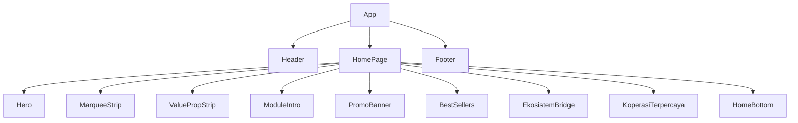

# Agrou — Peta Komponen React

> Semua komponen ada di `agrou/src/components/`. Dokumen ini memetakan setiap komponen ke modul bisnis, route, dan status implementasinya.

---

## 1. Halaman Utama (Homepage)

Dirender sebagai `<HomePage>` inline di `App.tsx` pada route `/`.

| Komponen | File | Fungsi |
|---|---|---|
| `Header` | `Header.tsx` | Navbar utama — logo, nav links, auth state, unread badge |
| `Hero` | `Hero.tsx` | Hero section dengan background image + CTA |
| `MarqueeStrip` | `MarqueeStrip.tsx` | Strip marquee animasi — komoditas / tagline |
| `ValuePropStrip` | `ValuePropStrip.tsx` | 3 value propositions Agrou |
| `ModuleIntro` | `ModuleIntro.tsx` | Intro 4 modul: Farm, Market, Gro AI, Connect |
| `PromoBanner` | `PromoBanner.tsx` | Banner promo dari DB — fallback ke 3 static banners jika DB kosong |
| `BestSellers` | `BestSellers.tsx` | Produk terlaris dari DB — fallback ke 6 static items |
| `EkosistemBridge` | `EkosistemBridge.tsx` | Visualisasi Data Bridge / siklus ekosistem |
| `KoperasiTerpercaya` | `KoperasiTerpercaya.tsx` | Daftar koperasi dari DB — fallback ke 5 static items |
| `HomeBottom` | `HomeBottom.tsx` | CTA section bawah homepage |
| `Footer` | `Footer.tsx` | Footer global — semua halaman kecuali dashboard/auth |
| `ScrollToTop` | `ScrollToTop.tsx` | Auto-scroll ke top saat navigasi |

**Catatan penting:**
- `PromoBanner` selalu pad ke 3 banner (merge DB + static)
- `BestSellers`: `(kop.rating ?? 0).toFixed(1)` — sudah null-safe
- `KoperasiTerpercaya`: sama, sudah null-safe untuk rating
- Background hero: `../assets/backgorund-hero.jpg` — **typo di nama file**, hati-hati jika rename

---

## 2. Agrou Farm (Modul Proteksi Lahan)

| Komponen | Route | Fungsi |
|---|---|---|
| `ShieldPage` | `/shield` | Halaman utama Farm — catalog produk proteksi |
| `ShieldModule` | (sub-komponen) | Card/list produk shield — dipakai di ShieldPage |
| `DiagnosisChatbot` | (sub-komponen) | Chatbot diagnosis AI — pilih komoditas → gejala → diagnosis → bundle |

**Catatan:**
- `DiagnosisChatbot.tsx` saat ini masih menggunakan `DIAGNOSIS_MAP` lokal (hardcoded)
- Perlu diwire ke `agrou-worker` Cloudflare Worker untuk AI response sebenarnya
- `ShieldPage` → redirect ke `/katalog` sudah dihandle

---

## 3. Agrou Market (Modul Produk Koperasi)

| Komponen | Route | Fungsi |
|---|---|---|
| `KatalogPage` | `/katalog` | Marketplace produk — filter kategori, search, list produk |
| `BrandPage` | `/brand` | Landing page Agrou Market / Brand module |
| `BrandModule` | (sub-komponen) | Komponen modul brand — card koperasi dengan branding |

**Catatan:**
- `KatalogPage` menggunakan `useSearchParams` untuk state kategori → URL shareable: `/katalog?kategori=padi`
- Bug lama sudah diperbaiki: `allProducts` sudah masuk `useMemo` deps

---

## 4. Gro AI

| Komponen | Route | Fungsi |
|---|---|---|
| `GroAIPage` | `/gro-ai` | Halaman utama Gro AI — Mode A (publik) + Mode B (login koperasi) |

**Mode A** (tanpa login):
- Template chat: Diagnosis Lahan, Simulasi PPL Virtual, Rekomendasi Produk, Cari Koperasi

**Mode B** (login, role `koperasi`):
- Panel modul: Cek Kelayakan Ekspor, Panduan Regulasi, Checklist Dokumen, Draft Otomatis, Pricing Internasional, Strategi Masuk Pasar

**Catatan:**
- Saat ini Gro AI berkomunikasi via `agrou-worker`
- Worker perlu dikonfigurasi dengan LLM API key (OpenAI atau compatible)

---

## 5. Koperasi

| Komponen | Route | Fungsi |
|---|---|---|
| `KoperasiPage` | `/koperasi` | List semua koperasi terdaftar — browse, filter lokasi |
| `KoperasiProfilePage` | `/koperasi/:id` | Profil detail satu koperasi — produk, badge, histori |

---

## 6. Komunitas

| Komponen | Route | Fungsi |
|---|---|---|
| `KomunitasPage` | `/komunitas` | Forum komunitas — post, komentar, like |

**Realtime aktif:**
- `useRealtimePosts` — invalidate cache saat ada post/komentar baru
- Post baru langsung muncul tanpa refresh

---

## 7. Dashboard (Protected)

Route `/dashboard` — hanya untuk user yang sudah login (`ProtectedRoute`).

### `DashboardPage`
Shell utama dashboard. Menampilkan tab/view sesuai role user dan pilihan menu sidebar.

Sub-halaman dashboard:

| Komponen | Fungsi | Role |
|---|---|---|
| `DashboardKoperasiProfile` | Edit profil koperasi — nama, lokasi, logo, banner (upload ke Storage) | `koperasi` |
| `DashboardBrandStock` | Kelola stok produk — tambah/edit/hapus produk + upload foto | `koperasi` / `petani` |
| `DashboardBrandOrders` | Kelola order masuk — konfirmasi, update status | `koperasi` / `petani` |
| `DashboardBrandRevenue` | Analitik revenue — grafik pendapatan, produk terlaris | `koperasi` / `petani` |
| `DashboardShieldStore` | Kelola produk proteksi di toko Farm | Admin / `koperasi` |
| `DashboardShieldOrders` | Kelola order proteksi — status, histori | `koperasi` |
| `DashboardMemberNeeds` | Input dan kelola kebutuhan anggota koperasi | `koperasi` |

**Realtime aktif di DashboardPage:**
- `useRealtimeOrders` — toast notif order baru + status update
- `useUnreadOrders` — badge counter di header

---

## 8. Auth

| Komponen | Route | Fungsi |
|---|---|---|
| `LoginPage` | `/masuk` | Form login email/password |
| `RegisterPage` | `/daftar` | Form registrasi — nama, email, password, pilih role |

Dibungkus `AuthRoute` — jika sudah login, redirect ke `/dashboard`.

---

## 9. Halaman Lain

| Komponen | Route | Fungsi |
|---|---|---|
| `AboutPage` | `/tentang` | Halaman tentang Agrou — visi, misi, tim |
| `DesignSystem` | (dev only) | Preview komponen UI — tidak ada di routing production |

---

## 10. UI Components (Reusable)

Semua ada di `agrou/src/components/ui/`:

| Komponen | Props Utama | Fungsi |
|---|---|---|
| `AvatarUpload` | `userId`, `currentUrl`, `onUpload` | Upload foto profil ke bucket `avatars` |
| `ProductImageUpload` | `userId`, `productId`, `onUpload` | Upload foto produk ke bucket `products` |
| `EmptyState` | `title`, `description`, `action?` | Tampilan saat data kosong |
| `ErrorState` | `message`, `onRetry?` | Tampilan saat terjadi error fetch |
| `LoadingSkeleton` | `count?`, `className?` | Skeleton loading card |

---

## 11. Custom Hooks

Semua ada di `agrou/src/hooks/`:

| Hook | File | Fungsi |
|---|---|---|
| `useAuth` | `useAuth.tsx` | Context auth — user, session, profile, signIn, signUp, signOut |
| `useProfile` | `useProfile.ts` | Fetch + update profil user aktif |
| `useRealtimeOrders` | `useRealtimeOrders.ts` | Subscribe realtime orders — toast notif |
| `useRealtimePosts` | `useRealtimePosts.ts` | Subscribe realtime posts/comments — invalidate cache |
| `useUnreadOrders` | `useUnreadOrders.ts` | Counter order belum dibaca untuk badge header |

---

## 12. Diagram Alur Komponen Homepage

